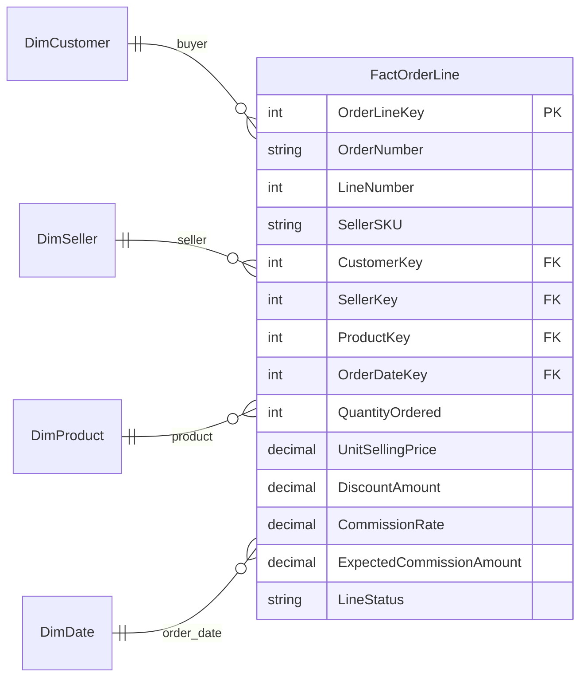
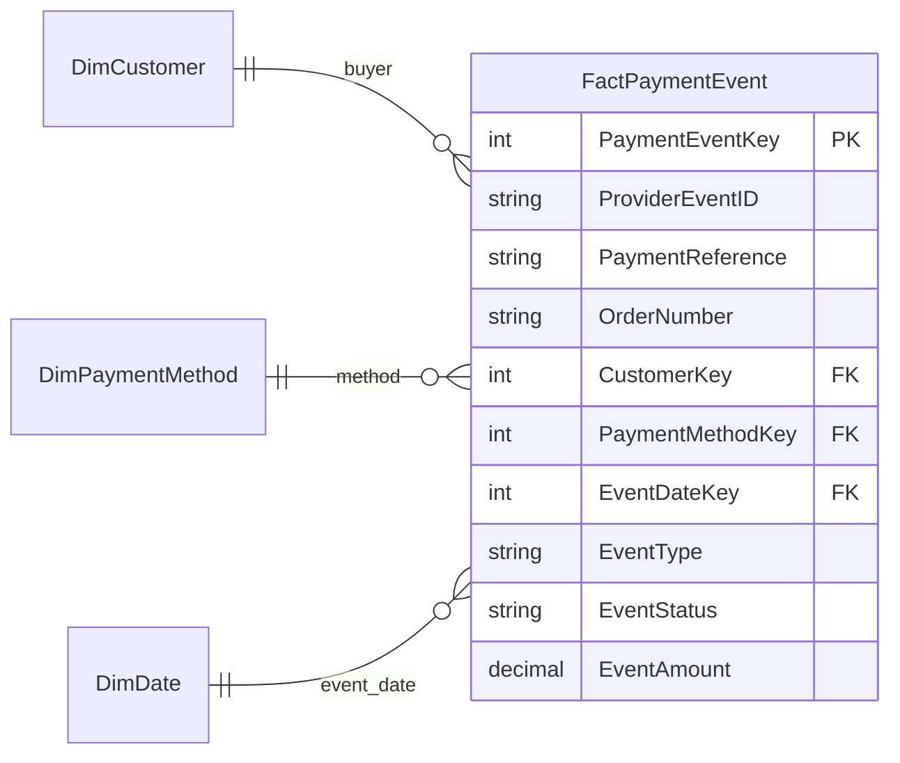
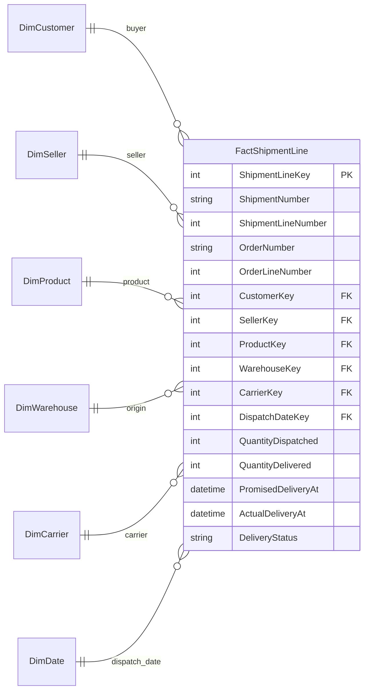
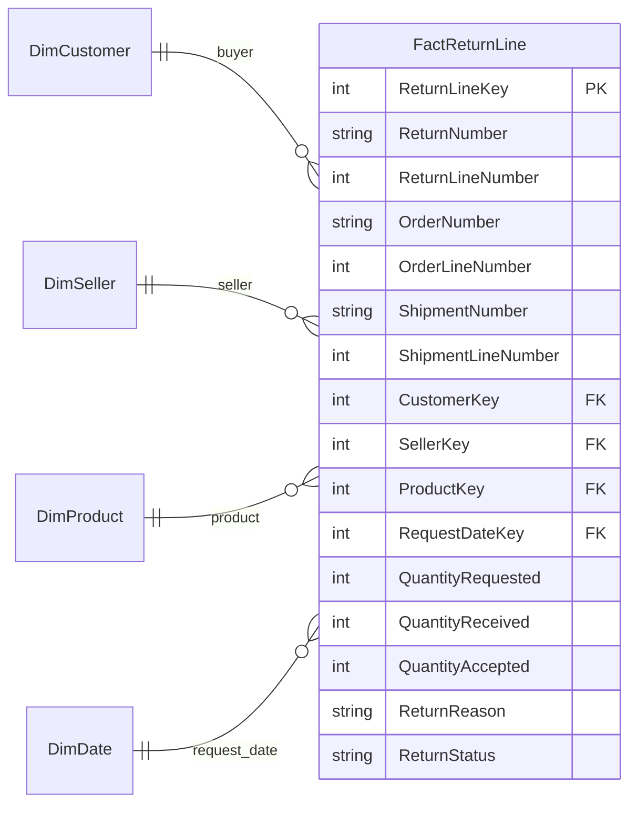
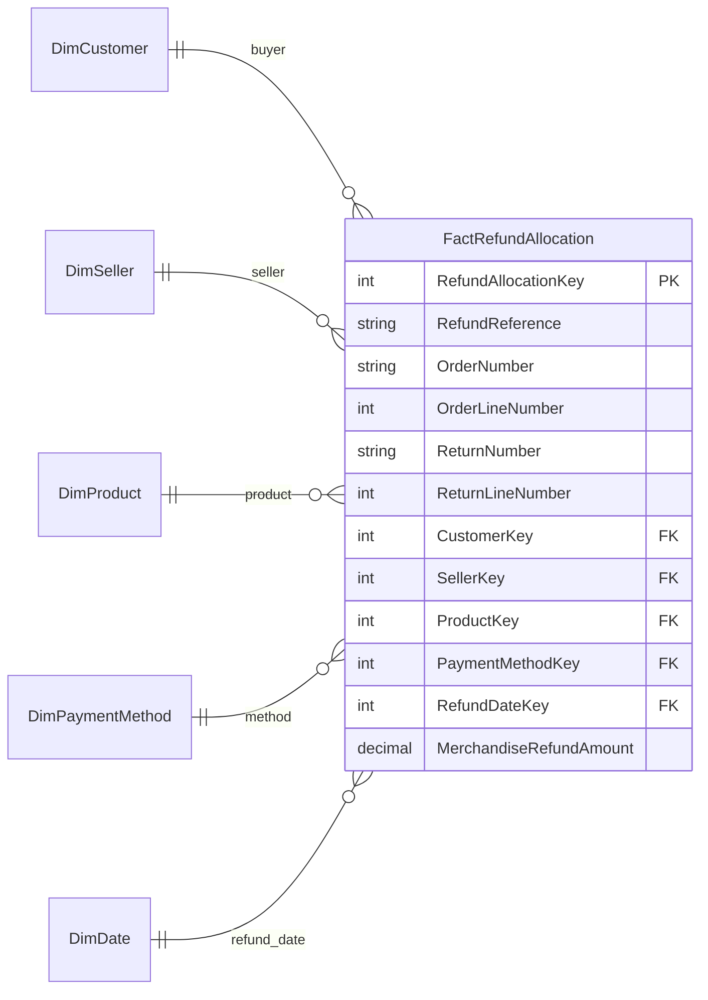
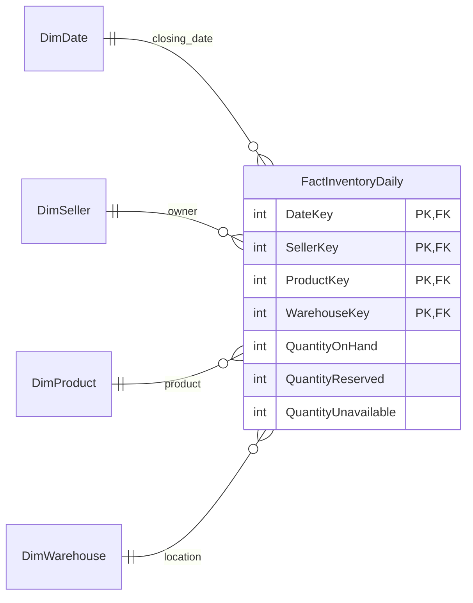

# Day 2 Project: E-commerce Marketplace Database Design

A dimensional database design for a fictional marketplace where customers buy products from independent sellers.

**Status:** Learning design. SQL implementation and query execution are planned.

This project explores business requirements, table grain, shared dimensions, and the difference between orders, payments, shipments, returns, and refunds.

## 1. Understand the business

**MarketBridge** is an online marketplace. Different businesses list products on its website. A customer can buy from several sellers in one checkout.

MarketBridge coordinates payment and fulfillment. Sellers own their stock. The marketplace earns a commission on eligible sales under its agreement with each seller.

For example, TechCorner sells headphones and HomeNest sells lamps. A customer can buy both in one order, but the sellers can send their goods in separate shipments.

**Customer:** the person buying. **Seller:** the business supplying a product. **Marketplace:** the platform connecting them.

MarketBridge uses participating warehouses to track seller-owned stock and external carriers to deliver orders. This is a specific business assumption; other marketplaces operate differently.

## 2. Follow one customer order

A customer named **Amina** places order **ORD-1001**.

| Line | Seller | Product | Quantity | Unit price | Line amount |
| --- | --- | --- | ---: | ---: | ---: |
| 1 | TechCorner | Headphones | 2 | 2,000 | 4,000 |
| 2 | HomeNest | Desk lamp | 1 | 1,500 | 1,500 |
| **Total** | | | **3** | | **5,500** |

All amounts are in BDT. To keep the example clear, there are no discounts, taxes, shipping charges, or payment fees.

Amina pays BDT 5,500. TechCorner ships two headphones, and HomeNest ships one lamp. Amina receives both shipments.

Later, Amina returns one defective headphone. The return is accepted, and BDT 2,000 is refunded.

This story creates:

- One order with **two order-line rows**.
- One successful payment capture, followed later by one successful refund event.
- Two shipment-line rows, belonging to two shipments.
- One return-line row.
- One refund-allocation row assigning the BDT 2,000 refund to the headphone order line.
- Separate daily stock rows for each seller, product, and warehouse.

An order does not prove payment. A payment does not prove delivery. A return request does not prove that a refund was paid.

## 3. Complete ER diagram

The model contains **seven dimension tables and six fact tables**. The complete diagram includes every column and relationship. The smaller diagrams later in the document explain each process separately.

**PK** identifies a row. **FK** connects to a dimension. The same dimension table is shared across processes.

```mermaid
erDiagram
    direction TB
    DimCustomer ||--o{ FactOrderLine : buyer
    DimSeller ||--o{ FactOrderLine : seller
    DimProduct ||--o{ FactOrderLine : product
    DimDate ||--o{ FactOrderLine : order_date
    DimCustomer ||--o{ FactPaymentEvent : buyer
    DimPaymentMethod ||--o{ FactPaymentEvent : method
    DimDate ||--o{ FactPaymentEvent : event_date
    DimCustomer ||--o{ FactShipmentLine : buyer
    DimSeller ||--o{ FactShipmentLine : seller
    DimProduct ||--o{ FactShipmentLine : product
    DimWarehouse ||--o{ FactShipmentLine : origin
    DimCarrier ||--o{ FactShipmentLine : carrier
    DimDate ||--o{ FactShipmentLine : dispatch_date
    DimCustomer ||--o{ FactReturnLine : buyer
    DimSeller ||--o{ FactReturnLine : seller
    DimProduct ||--o{ FactReturnLine : product
    DimDate ||--o{ FactReturnLine : request_date
    DimCustomer ||--o{ FactRefundAllocation : buyer
    DimSeller ||--o{ FactRefundAllocation : seller
    DimProduct ||--o{ FactRefundAllocation : product
    DimPaymentMethod ||--o{ FactRefundAllocation : method
    DimDate ||--o{ FactRefundAllocation : refund_date
    DimDate ||--o{ FactInventoryDaily : closing_date
    DimSeller ||--o{ FactInventoryDaily : owner
    DimProduct ||--o{ FactInventoryDaily : product
    DimWarehouse ||--o{ FactInventoryDaily : location
    DimCustomer {
        int CustomerKey PK
        string CustomerName
        string Email
        string Phone
    }
    DimSeller {
        int SellerKey PK
        string SellerName
        string BusinessType
        string City
    }
    DimProduct {
        int ProductKey PK
        string ProductName
        string Brand
        string Category
        string Variant
    }
    DimWarehouse {
        int WarehouseKey PK
        string WarehouseName
        string City
    }
    DimCarrier {
        int CarrierKey PK
        string CarrierName
        string ServiceType
    }
    DimPaymentMethod {
        int PaymentMethodKey PK
        string MethodName
        string Provider
    }
    DimDate {
        int DateKey PK
        date FullDate
        int MonthNumber
        int QuarterNumber
        int YearNumber
    }
    FactOrderLine {
        int OrderLineKey PK
        string OrderNumber
        int LineNumber
        string SellerSKU
        int CustomerKey FK
        int SellerKey FK
        int ProductKey FK
        int OrderDateKey FK
        int QuantityOrdered
        decimal UnitSellingPrice
        decimal DiscountAmount
        decimal CommissionRate
        decimal ExpectedCommissionAmount
        string LineStatus
    }
    FactPaymentEvent {
        int PaymentEventKey PK
        string ProviderEventID
        string PaymentReference
        string OrderNumber
        int CustomerKey FK
        int PaymentMethodKey FK
        int EventDateKey FK
        string EventType
        string EventStatus
        decimal EventAmount
    }
    FactShipmentLine {
        int ShipmentLineKey PK
        string ShipmentNumber
        int ShipmentLineNumber
        string OrderNumber
        int OrderLineNumber
        int CustomerKey FK
        int SellerKey FK
        int ProductKey FK
        int WarehouseKey FK
        int CarrierKey FK
        int DispatchDateKey FK
        int QuantityDispatched
        int QuantityDelivered
        datetime PromisedDeliveryAt
        datetime ActualDeliveryAt
        string DeliveryStatus
    }
    FactReturnLine {
        int ReturnLineKey PK
        string ReturnNumber
        int ReturnLineNumber
        string OrderNumber
        int OrderLineNumber
        string ShipmentNumber
        int ShipmentLineNumber
        int CustomerKey FK
        int SellerKey FK
        int ProductKey FK
        int RequestDateKey FK
        int QuantityRequested
        int QuantityReceived
        int QuantityAccepted
        string ReturnReason
        string ReturnStatus
    }
    FactRefundAllocation {
        int RefundAllocationKey PK
        string RefundReference
        string OrderNumber
        int OrderLineNumber
        string ReturnNumber
        int ReturnLineNumber
        int CustomerKey FK
        int SellerKey FK
        int ProductKey FK
        int PaymentMethodKey FK
        int RefundDateKey FK
        decimal MerchandiseRefundAmount
    }
    FactInventoryDaily {
        int DateKey PK, FK
        int SellerKey PK, FK
        int ProductKey PK, FK
        int WarehouseKey PK, FK
        int QuantityOnHand
        int QuantityReserved
        int QuantityUnavailable
    }

```

<strong>Open the complete ER diagram — all 13 tables</strong>

### How the business stages connect

The dimension relationships show who, what, where, and when. Business references connect the events:

| Reference | Purpose |
| --- | --- |
| OrderNumber + LineNumber | Identifies a product line in a customer order |
| OrderNumber on a payment event | Identifies the order being paid or refunded |
| OrderNumber + OrderLineNumber on shipment and return rows | Identifies the order line being fulfilled or returned |
| ShipmentNumber + ShipmentLineNumber on a return | Identifies which delivered shipment line is being returned |
| RefundReference | Matches a successful refund payment event to its order-line allocations |
| ReturnNumber + ReturnLineNumber on a refund allocation | Identifies the return behind the refund, when applicable |

These are business identifiers. They are not drawn as foreign keys between fact tables in this analytical design. Data-loading checks must confirm that the references exist and agree with the associated customer, seller, and product keys.

## 4. Dimension tables: the details we reuse

| Table | One row describes | Why it matters |
| --- | --- | --- |
| DimCustomer | One customer | Group orders and refunds by buyer |
| DimSeller | One seller business | Separate each seller's sales and stock |
| DimProduct | One catalog product variant | Distinguish products, including different variants |
| DimWarehouse | One storage location | Track where stock is held and dispatched |
| DimCarrier | One carrier/service combination | Compare delivery services |
| DimPaymentMethod | One payment-method/provider combination | Compare payment channels |
| DimDate | One calendar date | Group different activities by month or year |

For example, TechCorner is stored once in DimSeller. Its SellerKey appears in the facts that describe its orders, deliveries, returns, refunds, and inventory.

The product dimension describes the item, while the seller dimension describes who sells it. The same catalog product can be sold by several sellers at different prices.

SellerSKU is recorded on the order line as a seller's business identifier. This version assumes one active seller SKU per seller/product pair. Full listing history is a future extension.

## 5. Fact tables: decide what one row means

The meaning of one row is called the table's **grain**.

| Fact table | One row represents |
| --- | --- |
| FactOrderLine | One seller's product line within a customer order |
| FactPaymentEvent | One uniquely identified payment-provider event for an order |
| FactShipmentLine | One part of an order line sent in a shipment |
| FactReturnLine | One return-request line referring to one delivered shipment line |
| FactRefundAllocation | One successful refund's merchandise amount allocated to one order line |
| FactInventoryDaily | One seller's product at one warehouse at the end of one date |

## 6. Orders: What did Amina buy?

An order can include several sellers and products. That is why the fact stores order lines rather than one row for the entire basket.

ORD-1001 has two rows: TechCorner's headphones and HomeNest's lamp. Each row records the buyer, seller, product, agreed price, and ordered quantity.

**Line amount = QuantityOrdered × UnitSellingPrice − DiscountAmount.** DiscountAmount is the total discount for that line, not a discount per unit.

Suppose TechCorner's commission rate is 10% and HomeNest's rate is 8%:

| Seller | Ordered merchandise amount | Rate | Expected commission |
| --- | ---: | ---: | ---: |
| TechCorner | 4,000 | 10% | 400 |
| HomeNest | 1,500 | 8% | 120 |
| Total | 5,500 | | 520 |

Store rates as decimal fractions, such as 0.10. ExpectedCommissionAmount records the amount expected at order time. It is not a final settlement or recognized platform revenue.

**Why keep prices here?** A later listing-price change must not change the old order's agreed price.

View this process and its table fields

## 7. Payments: Did the money move?

The payment fact works at order level, not product-line level. Amina's single BDT 5,500 payment covers both sellers.

| ProviderEventID | PaymentReference | OrderNumber | EventType | EventStatus | EventAmount |
| --- | --- | --- | --- | --- | ---: |
| EVT-001 | PAY-001 | ORD-1001 | CAPTURE | SUCCESS | 5,500 |
| EVT-002 | RF-001 | ORD-1001 | REFUND | SUCCESS | 2,000 |

A capture records money collected. A refund event records money returned. Refunds are positive amounts here; the event type determines how to use them in calculations.

**Net customer cash collected = successful captures − successful refunds = BDT 3,500.** This is a payment measure, not a full revenue or profit calculation.

A failed capture is a separate event, but contributes zero to collected cash. ProviderEventID must be unique so a repeated provider notification cannot be counted twice.

This simplified model includes capture and refund outcomes. Authorization holds, chargebacks, and disputes are future extensions.

View this process and its table fields

## 8. Shipping: What was sent and delivered?

The marketplace splits ORD-1001 into two shipments because the sellers fulfill their lines separately.

| Shipment | Order line | Seller | Dispatched | Delivered |
| --- | ---: | --- | ---: | ---: |
| SH-001 | 1 | TechCorner | 2 | 2 |
| SH-002 | 2 | HomeNest | 1 | 1 |

Each shipment uses one origin warehouse and one carrier. A larger order line can also be split across several shipments.

QuantityDelivered stays unknown until a delivery result is recorded. The row starts at dispatch and is updated with its final delivery outcome. Repeated delivery attempts are not modeled separately in this version.

PromisedDeliveryAt records the promised deadline. ActualDeliveryAt records completion. For a fully delivered shipment line, comparing them tells us whether it arrived on time. An undelivered overdue line is a separate condition and should not be treated as on time.

**Important:** several product lines can share one ShipmentNumber. Count distinct shipment numbers when measuring how many shipments were sent.

View this process and its table fields

## 9. Returns: What did the customer send back?

Amina requests a return of one headphone from shipment SH-001.

| Return | Order line | Reason | Requested | Received | Accepted |
| --- | ---: | --- | ---: | ---: | ---: |
| RET-001 | 1 | Defective item | 1 | 1 | 1 |

The quantities describe different stages. A customer can request a return before the warehouse receives it. A received item may still need inspection before acceptance.

This table starts with the request and is updated as the return progresses. QuantityReceived and QuantityAccepted can be unknown while their stages are pending.

An accepted return does not necessarily mean the product can be sold again. The defective headphone goes into unavailable stock after physical receipt. Its refund is tracked separately.

View this process and its table fields

## 10. Refunds: Which product received the money back?

FactPaymentEvent records that BDT 2,000 was refunded. FactRefundAllocation explains which order line that money belongs to.

| RefundReference | OrderNumber | OrderLineNumber | ReturnNumber | MerchandiseRefundAmount |
| --- | --- | ---: | --- | ---: |
| RF-001 | ORD-1001 | 1 | RET-001 | 2,000 |

For a refund covering several order lines, create one allocation per affected line. In this merchandise-only model, the allocations must add up to the successful refund event's amount.

These two tables describe the same money at different levels. **Do not add payment refund events and refund allocations together.** Use events for cash totals and allocations for seller/product breakdowns.

A cancellation before shipping can also cause a refund. In that case, ReturnNumber and ReturnLineNumber can be empty because no physical return occurred.

Under an assumed proportional commission-reversal policy, the headphone refund would reverse BDT 200 of expected commission. Remaining expected commission would be BDT 320. The current model does not record actual seller payouts or commission settlement adjustments; those need a settlement fact in a later version.

View this process and its table fields

## 11. Inventory: What can each seller still sell?

Stock ownership matters in a marketplace. Ten headphones owned by TechCorner are separate from ten identical headphones owned by another seller.

The primary key combines DateKey, SellerKey, ProductKey, and WarehouseKey.

- **QuantityOnHand:** All physically held units, including unavailable units.
- **QuantityReserved:** Sellable units set aside for orders but not yet dispatched.
- **QuantityUnavailable:** Held units that cannot be sold, such as damaged or quarantined goods.

**Available quantity = On hand − Reserved − Unavailable.** Reserved and unavailable units must not overlap.

Suppose TechCorner starts with ten headphones and HomeNest starts with five lamps:

| Stage | TechCorner headphones on hand | Unavailable headphones | Available headphones | HomeNest lamps on hand |
| --- | ---: | ---: | ---: | ---: |
| Before orders, no reservations | 10 | 0 | 10 | 5 |
| After both shipments leave | 8 | 0 | 8 | 4 |
| Defective headphone physically returned | 9 | 1 | 8 | 4 |

These are explanatory stages. The fact stores the closing balance for each date, not every stock movement. A stock-movement ledger is needed to audit each individual change.

View this process and its table fields

## 12. Business rules behind this design

- One order belongs to one customer and may include multiple sellers.
- Each order line belongs to exactly one seller and one product variant.
- The pair OrderNumber and LineNumber uniquely identifies an order line.
- Each shipment belongs to one order and one seller and uses one warehouse and carrier.
- Each shipment line fulfills exactly one order line. ShipmentNumber and ShipmentLineNumber must be unique together.
- Each return line refers to one shipped line. Returns spanning several shipped lines use several return lines.
- ReturnNumber and ReturnLineNumber must be unique together.
- Each payment-provider event is recorded once. Captures and refunds use separate event records.
- Each successful refund has at most one allocation per order line in this version. If several return lines feed that allocation, a separate allocation-detail table would be required; this version assumes at most one related return line per allocation.
- Refunded merchandise amounts cannot exceed the remaining refundable merchandise amounts.
- All sample money is BDT. Currency conversion, taxes, shipping fees, and gift cards are outside this version.
- Dimensions store current descriptions. Historical dimension versions are a future addition.

Before implementation, these assumptions should be reviewed with business users. Foreign keys alone cannot enforce every rule across rows and processes.

## 13. Avoid misleading results

### Payment double counting

Joining the BDT 5,500 order payment to two order lines repeats it twice. Summing that joined column produces an incorrect BDT 11,000.

Calculate payment totals at order level before comparing them with order totals. Seller-level cash allocation requires a defined allocation rule; it cannot be inferred merely by joining an order payment to its lines.

### Shipment and return double counting

An order line can match several shipments and several return events. Joining all those raw rows can multiply the records. Summarize each process to the required common level first.

### Stock across dates

Eight headphones on Monday and the same eight on Tuesday do not mean sixteen headphones. Select a date for a stock balance, or calculate a deliberate average over time.

### Gross sales and platform income

Marketplace merchandise value belongs to a different measure from platform commission. The BDT 5,500 basket is not BDT 5,500 of platform commission income.

### Unknown versus zero

Unknown delivery or return quantities mean the result is not yet recorded. Zero means the result is known and none were delivered or accepted. Do not silently treat these as the same business state.

## 14. Questions this model can answer

| Question | Main data needed |
| --- | --- |
| Which sellers receive the most ordered merchandise value? | Order lines and seller dimension |
| How much successful customer cash was captured or refunded? | Payment events filtered by type and status |
| Which orders are only partly delivered? | Ordered quantities compared with shipment outcomes |
| Which products have the most accepted returns? | Return lines and product dimension |
| How much merchandise was refunded for each seller? | Refund allocations and seller dimension |
| Which completed shipment lines arrived after their promise? | Shipment timestamps and carrier dimension |
| How much available stock does each seller have? | Daily inventory at a selected date |

A return rate also needs a clearly defined denominator and time window. Returns received this month may relate to sales from an earlier month.

## 15. What the worked example should produce

| Check | Expected result |
| --- | ---: |
| Customer orders | 1 |
| Order lines | 2 |
| Ordered units | 3 |
| Ordered merchandise amount | BDT 5,500 |
| Successful captured cash | BDT 5,500 |
| Distinct dispatched shipments | 2 |
| Delivered units before the return | 3 |
| Accepted returned units | 1 |
| Successful refunded cash | BDT 2,000 |
| Net customer cash collected | BDT 3,500 |
| Available headphones after the defective return | 8 |
| Available lamps after dispatch | 4 |

These are manually calculated reference results. They are not outputs from an implemented SQL database.

## 16. What I learned

The hardest part of this design is deciding what each row means. An order, order line, payment event, shipment line, return line, and refund allocation are different records.

Shared dimensions let us analyze different processes using consistent customers, sellers, products, and dates. Business references connect the processes, while careful aggregation prevents double counting.

## 17. Next steps

- [ ] Review the business assumptions with my instructor.
- [ ] Choose a SQL database and create the tables.
- [ ] Load the worked example and verify the expected results.
- [ ] Test partial shipments, failed captures, and refunds without returns.
- [ ] Add validation for quantities, unique references, and refund totals.
- [ ] Extend the model with seller settlements, stock movements, and historical listing data.

## Acknowledgment

This project follows the fact-and-dimension approach introduced in class. The marketplace, rules, and example transactions are fictional. AI assisted with domain exploration and the draft model; real requirements would need confirmation with business users.
