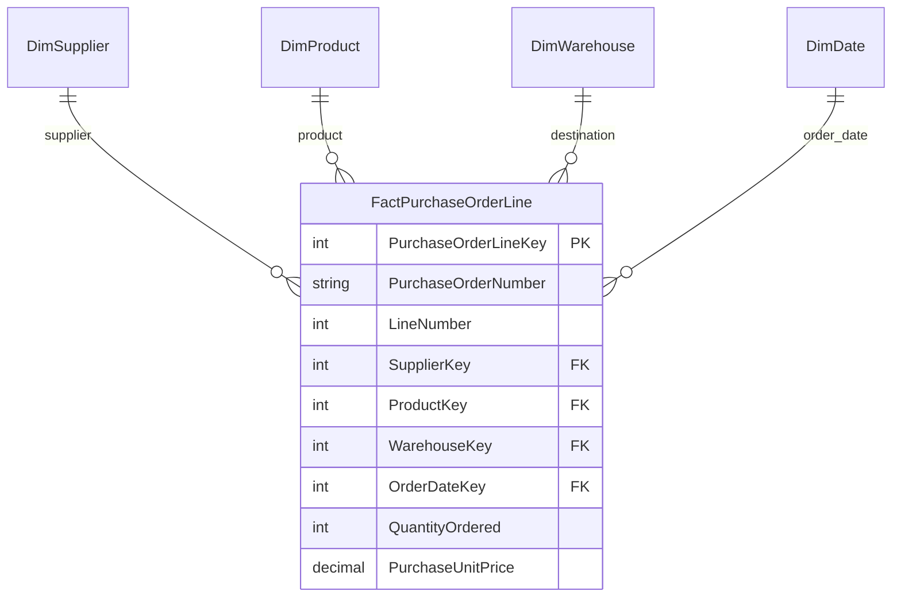
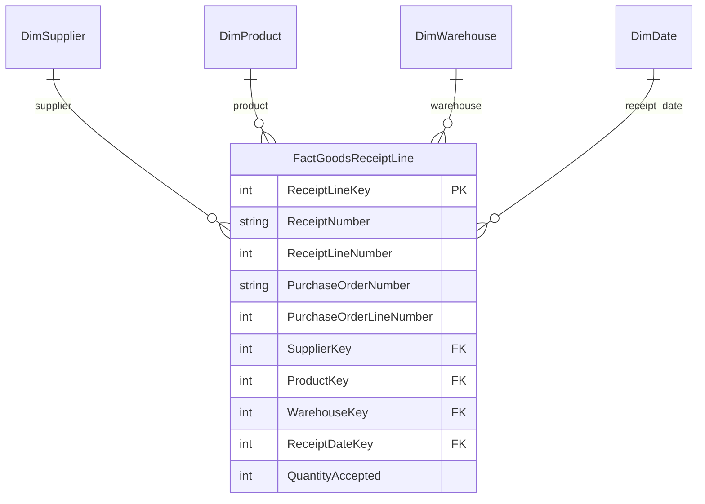
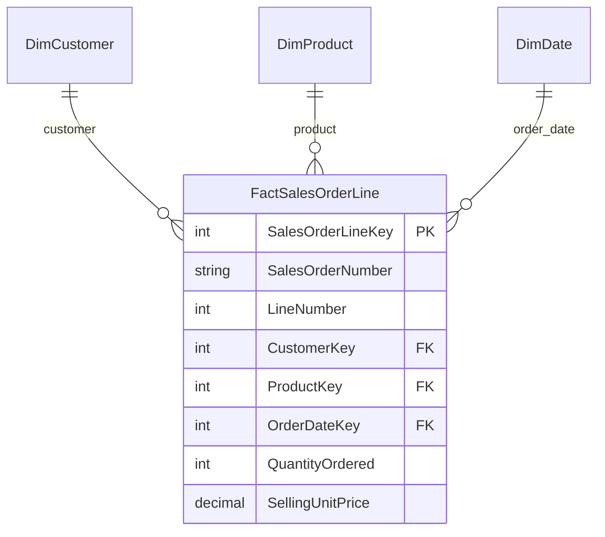
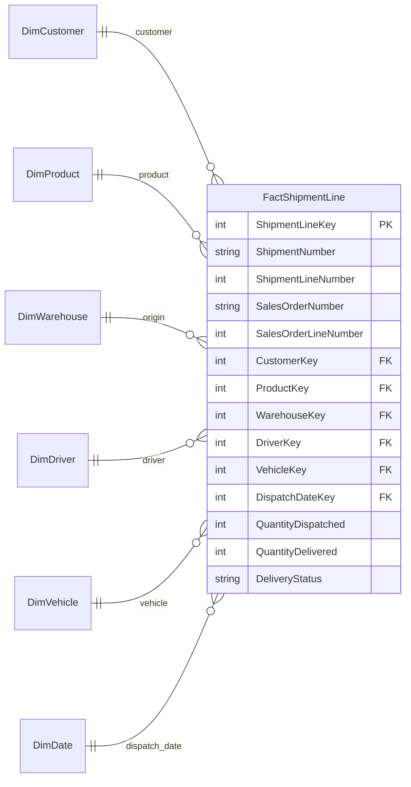
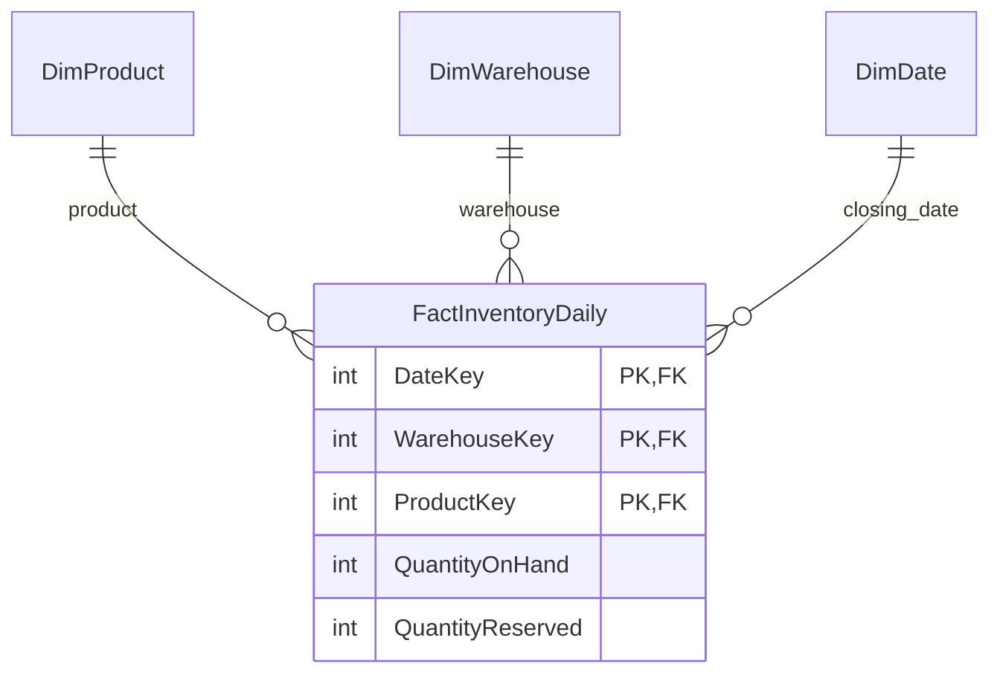

# Day 2 Project: Logistics & Supply Chain Database

I designed a database model for a fictional company that buys goods, stores them, and delivers them to shops. This project applies the fact and dimension tables introduced in class.

**Status:** Database design completed as a learning draft. SQL implementation is planned.

## The business

**FlowLink** buys packaged goods from manufacturers and sells them to supermarkets.

A typical transaction looks like this:

1. FlowLink orders goods from a supplier.
2. The supplier sends the goods to a warehouse.
3. A shop places an order with FlowLink.
4. FlowLink sends the goods using a driver and vehicle.
5. The company checks how much stock remains.

The supplier sells to FlowLink. The customer buys from FlowLink.

## One example to follow

FlowLink orders **100 cartons of cooking oil** from FreshOil Manufacturing at **BDT 1,000 per carton**.

The supplier sends 60 cartons first and 40 later.

City Mart then orders **30 cartons** at **BDT 1,200 per carton**. FlowLink sends 20 cartons with Hasan and the remaining 10 with Karim. Both deliveries succeed.

| Business activity | What happened |
| --- | --- |
| Purchase order | 100 cartons ordered |
| Goods receipts | 60 cartons received, then 40 |
| Customer order | 30 cartons requested |
| Shipments | 20 cartons sent, then 10 |
| Remaining stock | 70 cartons |

The stock calculation assumes there was no opening stock and no other stock movement.

**The important difference:** an order records a request. A receipt or shipment records what actually moved.

## The database structure

**Dimensions describe the business. Facts record its activities and quantities.**

The model uses these shared dimension tables:

| Dimension | Details stored |
| --- | --- |
| DimSupplier | SupplierKey, SupplierName, Phone, City |
| DimProduct | ProductKey, ProductName, Category, UnitOfMeasure |
| DimCustomer | CustomerKey, CustomerName, Phone, City |
| DimWarehouse | WarehouseKey, WarehouseName, Address |
| DimDriver | DriverKey, DriverName, Phone |
| DimVehicle | VehicleKey, RegistrationNumber, VehicleType |
| DimDate | DateKey, FullDate, MonthNumber, YearNumber |

Each table's Key is its primary key. For example, DriverKey identifies one driver.

The diagrams below show one process at a time. A repeated name such as DimProduct means the **same table**, not a new copy.

**PK** identifies a row. **FK** connects it to a dimension. Each dimension can connect to many fact rows.

## Complete ER diagram

This is the complete model: **seven shared dimension tables and five fact tables**, including their columns and relationships.

The full diagram is a map of the whole database. The smaller diagrams below explain each part. Expand the full diagram when you need to trace a relationship or inspect a column.

- **PK (primary key):** identifies a row.
- **FK (foreign key):** stores the key of a connected dimension record.
- **One-to-many:** one dimension record can be used by many fact records.
- **Shared dimension:** the same product, warehouse, or date table supports several business activities.

```mermaid
erDiagram
    direction TB
    DimSupplier ||--o{ FactPurchaseOrderLine : supplier
    DimProduct ||--o{ FactPurchaseOrderLine : product
    DimWarehouse ||--o{ FactPurchaseOrderLine : destination
    DimDate ||--o{ FactPurchaseOrderLine : order_date
    DimSupplier ||--o{ FactGoodsReceiptLine : supplier
    DimProduct ||--o{ FactGoodsReceiptLine : product
    DimWarehouse ||--o{ FactGoodsReceiptLine : warehouse
    DimDate ||--o{ FactGoodsReceiptLine : receipt_date
    DimCustomer ||--o{ FactSalesOrderLine : customer
    DimProduct ||--o{ FactSalesOrderLine : product
    DimDate ||--o{ FactSalesOrderLine : order_date
    DimCustomer ||--o{ FactShipmentLine : customer
    DimProduct ||--o{ FactShipmentLine : product
    DimWarehouse ||--o{ FactShipmentLine : origin
    DimDriver ||--o{ FactShipmentLine : driver
    DimVehicle ||--o{ FactShipmentLine : vehicle
    DimDate ||--o{ FactShipmentLine : dispatch_date
    DimProduct ||--o{ FactInventoryDaily : product
    DimWarehouse ||--o{ FactInventoryDaily : warehouse
    DimDate ||--o{ FactInventoryDaily : closing_date

    DimSupplier {
        int SupplierKey PK
        string SupplierName
        string Phone
        string City
    }

    DimProduct {
        int ProductKey PK
        string ProductName
        string Category
        string UnitOfMeasure
    }

    DimCustomer {
        int CustomerKey PK
        string CustomerName
        string Phone
        string City
    }

    DimWarehouse {
        int WarehouseKey PK
        string WarehouseName
        string Address
    }

    DimDriver {
        int DriverKey PK
        string DriverName
        string Phone
    }

    DimVehicle {
        int VehicleKey PK
        string RegistrationNumber
        string VehicleType
    }

    DimDate {
        int DateKey PK
        date FullDate
        int MonthNumber
        int YearNumber
    }

    FactPurchaseOrderLine {
        int PurchaseOrderLineKey PK
        string PurchaseOrderNumber
        int LineNumber
        int SupplierKey FK
        int ProductKey FK
        int WarehouseKey FK
        int OrderDateKey FK
        int QuantityOrdered
        decimal PurchaseUnitPrice
    }

    FactGoodsReceiptLine {
        int ReceiptLineKey PK
        string ReceiptNumber
        int ReceiptLineNumber
        string PurchaseOrderNumber
        int PurchaseOrderLineNumber
        int SupplierKey FK
        int ProductKey FK
        int WarehouseKey FK
        int ReceiptDateKey FK
        int QuantityAccepted
    }

    FactSalesOrderLine {
        int SalesOrderLineKey PK
        string SalesOrderNumber
        int LineNumber
        int CustomerKey FK
        int ProductKey FK
        int OrderDateKey FK
        int QuantityOrdered
        decimal SellingUnitPrice
    }

    FactShipmentLine {
        int ShipmentLineKey PK
        string ShipmentNumber
        int ShipmentLineNumber
        string SalesOrderNumber
        int SalesOrderLineNumber
        int CustomerKey FK
        int ProductKey FK
        int WarehouseKey FK
        int DriverKey FK
        int VehicleKey FK
        int DispatchDateKey FK
        int QuantityDispatched
        int QuantityDelivered
        string DeliveryStatus
    }

    FactInventoryDaily {
        int DateKey PK, FK
        int WarehouseKey PK, FK
        int ProductKey PK, FK
        int QuantityOnHand
        int QuantityReserved
    }
```

<strong>Open the complete ER diagram — all 12 tables</strong>

### Why there are no direct lines between fact tables

The solid relationships above connect fact rows to their dimensions. Business document references connect the stages of the process:

| Record | Reference it keeps | What the reference tells us |
| --- | --- | --- |
| Goods receipt | PurchaseOrderNumber + PurchaseOrderLineNumber | Which ordered product line arrived |
| Shipment line | SalesOrderNumber + SalesOrderLineNumber | Which customer order line was sent |
| Daily inventory | ProductKey + WarehouseKey + DateKey | Which product, location, and closing date the stock belongs to |

Those order references are business identifiers, not dimension foreign keys in this design. They must be checked against the source orders when loading the data. This analytical model does not show a separate operational order-processing system.

## Walk through the records

### First, identify the people, product, and place

The dimension tables might contain these records:

| Dimension | Key | Record |
| --- | ---: | --- |
| DimSupplier | 1 | FreshOil Manufacturing |
| DimProduct | 101 | Cooking oil carton |
| DimCustomer | 201 | City Mart |
| DimWarehouse | 301 | Dhaka Warehouse |
| DimDriver | 401 | Hasan |
| DimDriver | 402 | Karim |
| DimVehicle | 501 | Truck A |
| DimVehicle | 502 | Van B |

For example, ProductKey 101 always points to the cooking oil carton in this example. We reuse that key when the oil is ordered, received, sold, shipped, or counted.

### A. Record what FlowLink wants to buy

FlowLink creates purchase order PO-101. Line 1 requests 100 cartons.

| PurchaseOrderNumber | LineNumber | SupplierKey | ProductKey | WarehouseKey | QuantityOrdered | PurchaseUnitPrice |
| --- | ---: | ---: | ---: | ---: | ---: | ---: |
| PO-101 | 1 | 1 | 101 | 301 | 100 | 1000 |

This goes into **FactPurchaseOrderLine**. It describes the request to the supplier. Warehouse stock has not increased yet.

A second product on the same purchase order would use another line number and another fact row.

### B. Record each arrival separately

| ReceiptNumber | ReceiptLineNumber | PurchaseOrderNumber | PurchaseOrderLineNumber | QuantityAccepted |
| --- | ---: | --- | ---: | ---: |
| GR-001 | 1 | PO-101 | 1 | 60 |
| GR-002 | 1 | PO-101 | 1 | 40 |

These are two **FactGoodsReceiptLine** rows. Each also stores the supplier, product, warehouse, and receipt-date keys.

After GR-001, 60 cartons have arrived and 40 are outstanding. After GR-002, all 100 have arrived. The purchase-order line stays one row throughout.

### C. Record what City Mart requests

| SalesOrderNumber | LineNumber | CustomerKey | ProductKey | QuantityOrdered | SellingUnitPrice |
| --- | ---: | ---: | ---: | ---: | ---: |
| SO-201 | 1 | 201 | 101 | 30 | 1200 |

This goes into **FactSalesOrderLine**. Its ordered amount is BDT 36,000. At this moment the goods can still be inside FlowLink's warehouse.

If staff reserve the 30 cartons, physical stock remains 100, reserved stock becomes 30, and stock available for other orders becomes 70.

### D. Record the two shipments

| ShipmentNumber | SalesOrderNumber | SalesOrderLineNumber | DriverKey | VehicleKey | QuantityDispatched | QuantityDelivered |
| --- | --- | ---: | ---: | ---: | ---: | ---: |
| SH-301 | SO-201 | 1 | 401 | 501 | 20 | 20 |
| SH-302 | SO-201 | 1 | 402 | 502 | 10 | 10 |

These go into **FactShipmentLine**. Each also contains its line number, customer, product, warehouse, and dispatch-date keys. The delivered quantities above show the final successful outcomes.

The two rows refer to the same customer order line. Hasan handled the first shipment; Karim handled the second.

Before delivery is confirmed, QuantityDelivered is unknown. It should not be interpreted as a confirmed delivery of zero cartons.

### E. Record the closing stock

After the first dispatch, physical stock is 80 cartons. If the remaining 10 cartons stay reserved, available stock is 70.

After the second dispatch, physical stock is 70, reserved stock is zero, and available stock is still 70.

| Stage | On hand | Reserved | Available |
| --- | ---: | ---: | ---: |
| Both supplier receipts accepted | 100 | 0 | 100 |
| Customer order reserved | 100 | 30 | 70 |
| First shipment dispatched | 80 | 10 | 70 |
| Second shipment dispatched | 70 | 0 | 70 |

This table explains changes during the day. **FactInventoryDaily stores only the end-of-day snapshot**, not every row of this sequence. Detailed stock changes would need a stock-movement table in a later version.

## How to read the table design

**Why store IDs instead of names in facts?** SupplierKey 1 connects to FreshOil's name and details. Reusing the key avoids repeating those details in every purchase or receipt row.

**Why put dates in a dimension?** A date record includes its month and year. This lets reports group different activities by the same calendar. OrderDateKey, ReceiptDateKey, and DispatchDateKey have different meanings but refer to the same DimDate table.

**Why keep purchase and selling prices in facts?** Prices belong to a particular agreement. If the price changes next month, the old order must still show its original price.

**Why does inventory have three primary-key columns?** A product can be in several warehouses, and each warehouse has a new balance each day. Product, warehouse, and date together identify the correct snapshot.

**Why several fact tables?** Ordered, received, dispatched, and delivered are different measurements. Mixing them into a single row would make partial arrivals and partial deliveries difficult to explain correctly.

## 1. Purchasing: What did we order?

**One row = one product line on a purchase order.**

Our example has one line: 100 cartons of oil at BDT 1,000 each.

**Business question:** How much did we order from each supplier?

## 2. Receiving: What arrived?

**One row = one receipt line for a purchase-order line.**

Our example needs two rows: one for 60 cartons and one for 40 cartons. Both refer to the same purchase-order line.

**Business question:** How much of our order is still waiting to arrive?

After the first receipt: 100 ordered - 60 received = **40 cartons outstanding**.

## 3. Sales: What did the customer request?

**One row = one product line on a customer order.**

City Mart's order creates one row for 30 cartons at BDT 1,200 each.

**Business question:** Which products do customers order most?

City Mart's ordered amount is 30 x 1,200 = **BDT 36,000**. This is an order amount, not proof of payment or recognized revenue.

## 4. Shipping: What did we send?

**One row = one product line within a shipment, fulfilling one sales-order line.**

Our example creates two rows: Hasan sends 20 cartons, and Karim sends 10 later.

**Business question:** Which orders are not fully delivered?

After the first successful delivery: 30 ordered - 20 delivered = **10 cartons still to deliver**.

QuantityDelivered stays unknown until the delivery result is recorded. A shipment with several products has several rows sharing the same ShipmentNumber.

## 5. Inventory: What stock remains?

**One row = one product at one warehouse at the end of one day.**

The three keys together identify a row.

- **QuantityOnHand:** Goods physically in the warehouse.
- **QuantityReserved:** Goods set aside for orders but still in the warehouse.
- **Available stock:** QuantityOnHand - QuantityReserved.

After receiving 100 cartons and dispatching 30, FlowLink has **70 cartons on hand**. Stock leaves the warehouse balance at dispatch, not when delivery is confirmed.

**Business question:** Which warehouse has stock available for a new order?

## Rules for this first design

- FlowLink owns the goods it buys.
- Each purchase-order line has one planned receiving warehouse.
- Each shipment serves one sales order and uses one warehouse, driver, and vehicle.
- All products have a defined stock unit. This example uses cartons.
- Purchase and sales orders can be fulfilled in parts.
- Receipts must match their purchase-order lines. Shipment lines must match their sales-order lines.
- Quantities cannot exceed the related ordered quantities in this version.
- Returns, damaged goods, transfers, payments, and repeated delivery attempts are future additions.

This is a reporting model. A working system also needs rules for safely processing transactions and checking stock.

## What I learned

**Define the row before choosing the columns.** One shipment is different from one product line in a shipment. This definition is called the table's grain.

**Keep requests separate from physical events.** Ordered, received, dispatched, and delivered quantities can differ.

**Avoid double counting.** Total receipts by purchase-order line before comparing them with ordered quantities. Do the same for shipments and sales-order lines.

**Count shipment numbers, not shipment rows.** One shipment can contain several products.

**Do not add stock balances across dates.** Having 70 cartons on Monday and the same 70 on Tuesday does not mean there are 140 cartons.

## Next step

Implement the tables in SQL, add the example records, and check that queries return:

- 100 cartons ordered from the supplier.
- 100 cartons received.
- 30 cartons ordered by City Mart.
- 30 cartons dispatched and delivered.
- 70 cartons remaining in the warehouse.

## Learning sources

This project applies the fact-and-dimension approach introduced in class. I used AI to help explore the business and draft the design. The company, assumptions, and example transactions are fictional and should be reviewed with my instructor.
