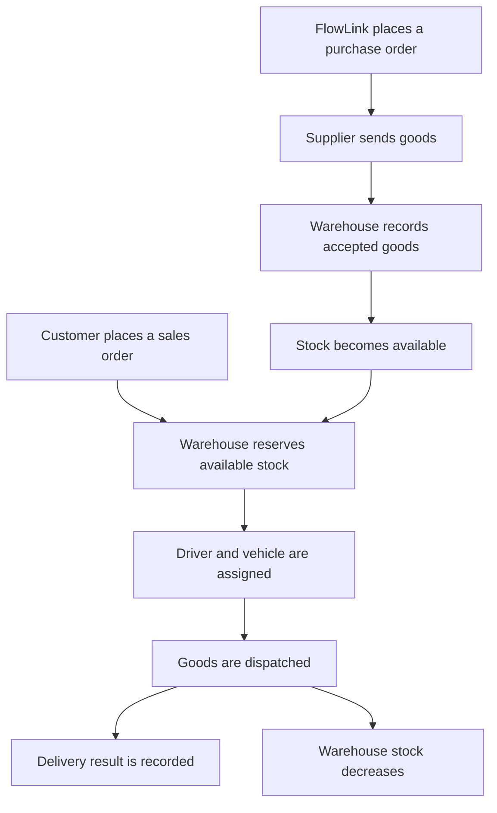
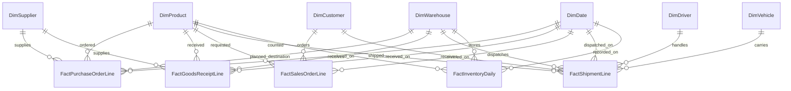

# Logistics and Supply Chain Database Design

A learning project that models how a fictional distribution company buys goods, receives stock, accepts customer orders, and delivers products.

**Project status:** Conceptual dimensional design. The SQL database and queries have not been implemented yet.

**Focus:** Business understanding, fact and dimension tables, table grain, relationships, and analytical questions.

## 1. Business Scenario

**FlowLink Distribution & Logistics** is a fictional company that buys packaged goods from manufacturers and sells them to supermarkets.

For example, FlowLink buys cartons of cooking oil from FreshOil Manufacturing, stores them in a warehouse, and sells them to City Mart. Drivers deliver the goods using company vehicles.

In this project:

- A **supplier** sells products to FlowLink.
- A **customer** buys products from FlowLink.
- A **warehouse** holds FlowLink's stock.
- A **purchase order** records what FlowLink asks a supplier to provide.
- A **goods receipt** records what actually arrives and is accepted.
- A **sales order** records what a customer requests.
- A **shipment** records goods dispatched to fulfill a customer order.

FlowLink earns income from selling goods. It also has costs such as purchasing, transport, storage, and salaries. This first model covers quantities and agreed purchase and selling prices. It does not calculate complete business profit.

## 2. Business Process

An order and a physical movement are separate events. Ordering 100 cartons does not mean that 100 cartons have arrived. A customer ordering 30 cartons does not mean that all 30 have been delivered.

## 3. Project Scope and Assumptions

This design covers purchasing, goods receiving, customer orders, outbound shipments, and daily stock reporting.

The following rules are assumptions for the fictional business:

- FlowLink owns the stock that it buys.
- An order can contain several product lines.
- Each purchase-order line has one planned destination warehouse.
- A supplier can fulfill a purchase-order line through several receipts.
- A sales-order line can be fulfilled through several shipments.
- Each shipment serves one sales order, leaves one warehouse, and uses one driver and vehicle.
- Shipment facts are created after dispatch, when a driver and vehicle are assigned.
- Each shipment line has one final delivery outcome. Repeated delivery attempts are outside this version.
- Each product has one defined stock unit. The example uses cartons throughout.
- Daily inventory records show stock at the end of the day.
- All example amounts are in Bangladeshi taka (BDT).

Returns, damaged goods, warehouse transfers, payments, taxes, batch tracking, and driver changes during a journey are outside this first version.

## 4. Why Fact and Dimension Tables?

**Dimension tables describe who, what, where, and when.**

For example, DimSupplier stores a supplier's name and contact information.

**Fact tables record business activities or measured states.**

For example, FactGoodsReceiptLine records how much of an ordered product was accepted into a warehouse.

This is an analytical model with several fact tables sharing dimensions. It is designed for reporting and learning. It is not a complete operational order-processing application.

## 5. ER Diagram

PK means primary key. FK means foreign key. The connecting lines show one-to-many relationships: one dimension record can appear in many fact rows.

The diagram focuses on relationships. The sections below list the proposed columns so that the diagram stays readable.

## 6. Dimension Tables

| Table | What one row describes | Proposed columns |
| --- | --- | --- |
| DimSupplier | One supplier | SupplierKey (PK), SupplierName, Phone, City |
| DimProduct | One product | ProductKey (PK), SKU, ProductName, Category, UnitOfMeasure |
| DimCustomer | One business customer | CustomerKey (PK), CustomerName, BusinessType, Phone, City |
| DimWarehouse | One warehouse | WarehouseKey (PK), WarehouseName, City, Address |
| DimDriver | One driver | DriverKey (PK), DriverName, Phone, LicenseNumber |
| DimVehicle | One vehicle | VehicleKey (PK), RegistrationNumber, VehicleType, CapacityKg |
| DimDate | One calendar date | DateKey (PK), FullDate, MonthNumber, QuarterNumber, YearNumber |

Names, phone numbers, addresses, and identifiers such as registration numbers use text types. Quantities use integers for this carton-based example. Prices and capacity use decimal types. Dates use date types.

The initial version keeps current descriptive details. Preserving historical versions of dimension attributes is a future improvement.

## 7. Fact Tables and Their Grain

**Grain means what one row represents.** Defining this first helps prevent mixing different kinds of information in the same table.

| Fact table | One row represents | Main measurements |
| --- | --- | --- |
| FactPurchaseOrderLine | One product line on one purchase order | QuantityOrdered, PurchaseUnitPrice |
| FactGoodsReceiptLine | One receipt line fulfilling one purchase-order line at one warehouse | QuantityAccepted |
| FactSalesOrderLine | One product line on one customer sales order | QuantityOrdered, SellingUnitPrice |
| FactShipmentLine | One shipment line fulfilling one sales-order line | QuantityDispatched, QuantityDelivered |
| FactInventoryDaily | One product at one warehouse at the end of one date | QuantityOnHand, QuantityReserved |

### FactPurchaseOrderLine

- PurchaseOrderLineKey — PK
- PurchaseOrderNumber
- LineNumber
- SupplierKey — FK to DimSupplier
- ProductKey — FK to DimProduct
- WarehouseKey — FK to DimWarehouse
- OrderDateKey — FK to DimDate
- QuantityOrdered
- PurchaseUnitPrice

The combination of PurchaseOrderNumber and LineNumber must be unique. Order numbers are assumed to be unique within this company.

### FactGoodsReceiptLine

- ReceiptLineKey — PK
- ReceiptNumber
- ReceiptLineNumber
- PurchaseOrderNumber
- PurchaseOrderLineNumber
- SupplierKey — FK to DimSupplier
- ProductKey — FK to DimProduct
- WarehouseKey — FK to DimWarehouse
- ReceiptDateKey — FK to DimDate
- QuantityAccepted

The combination of ReceiptNumber and ReceiptLineNumber must be unique. Purchase-order references identify which ordered line the receipt fulfills.

### FactSalesOrderLine

- SalesOrderLineKey — PK
- SalesOrderNumber
- LineNumber
- CustomerKey — FK to DimCustomer
- ProductKey — FK to DimProduct
- OrderDateKey — FK to DimDate
- QuantityOrdered
- SellingUnitPrice

The combination of SalesOrderNumber and LineNumber must be unique.

### FactShipmentLine

- ShipmentLineKey — PK
- ShipmentNumber
- ShipmentLineNumber
- SalesOrderNumber
- SalesOrderLineNumber
- CustomerKey — FK to DimCustomer
- ProductKey — FK to DimProduct
- WarehouseKey — FK to DimWarehouse
- DriverKey — FK to DimDriver
- VehicleKey — FK to DimVehicle
- DispatchDateKey — FK to DimDate
- QuantityDispatched
- QuantityDelivered — unknown until the outcome is recorded
- DeliveryStatus — for example, InTransit or Delivered

The combination of ShipmentNumber and ShipmentLineNumber must be unique. Sales-order references identify which requested line the shipment fulfills.

A shipment with two products has at least two rows. Its shipment number repeats across those rows.

This fact starts at dispatch and is updated with the delivery outcome. Unknown delivered quantity should not be treated as a confirmed zero.

### FactInventoryDaily

- DateKey — PK component and FK to DimDate
- WarehouseKey — PK component and FK to DimWarehouse
- ProductKey — PK component and FK to DimProduct
- QuantityOnHand
- QuantityReserved

The three keys together form the primary key. There is only one closing-stock row for each date, warehouse, and product combination.

AvailableQuantity = QuantityOnHand - QuantityReserved.

This table stores a daily snapshot. It does not replace a detailed stock-movement ledger.

### How the business events connect

Purchase-order and sales-order references connect the stages of the process. In a reporting model, these references can be retained as business identifiers rather than drawing direct foreign-key links between every fact table.

The data-loading process must check that receipt and shipment references exist and match the correct product, supplier or customer, and warehouse rules. The dimension foreign keys alone cannot prove this.

## 8. Worked Example

FlowLink orders 100 cartons of cooking oil from FreshOil Manufacturing at BDT 1,000 per carton.

### Purchase order

| PurchaseOrderNumber | LineNumber | Product | QuantityOrdered | PurchaseUnitPrice |
| --- | ---: | --- | ---: | ---: |
| PO-101 | 1 | Oil carton | 100 | 1000 |

Ordered purchase amount: **100 x 1,000 = BDT 100,000**. This describes the order commitment, not a payment or invoice.

### Goods receipts

The supplier delivers in two batches.

| ReceiptNumber | ReceiptLineNumber | PurchaseOrderNumber | PurchaseOrderLineNumber | Warehouse | QuantityAccepted |
| --- | ---: | --- | ---: | --- | ---: |
| GR-001 | 1 | PO-101 | 1 | Dhaka | 60 |
| GR-002 | 1 | PO-101 | 1 | Dhaka | 40 |

After the first receipt, 40 cartons remain outstanding. After the second, the order line is fully received.

### Customer order

City Mart orders 30 cartons at BDT 1,200 per carton.

| SalesOrderNumber | LineNumber | Customer | Product | QuantityOrdered | SellingUnitPrice |
| --- | ---: | --- | --- | ---: | ---: |
| SO-201 | 1 | City Mart | Oil carton | 30 | 1200 |

Ordered sales amount: **30 x 1,200 = BDT 36,000**. An order amount is not automatically recognized revenue.

### Shipments

FlowLink fulfills the order in two shipments, both successfully delivered.

| ShipmentNumber | ShipmentLineNumber | SalesOrderNumber | SalesOrderLineNumber | Driver | QuantityDispatched | QuantityDelivered |
| --- | ---: | --- | ---: | --- | ---: | ---: |
| SH-301 | 1 | SO-201 | 1 | Hasan | 20 | 20 |
| SH-302 | 1 | SO-201 | 1 | Karim | 10 | 10 |

After the first delivery, 10 cartons remain to be delivered. After the second, the order is fully delivered.

### Closing inventory

Assume opening stock was zero, both receipts arrived before dispatch, and no other stock movements occurred.

Closing stock = 0 + 60 + 40 - 20 - 10 = **70 cartons**.

| Snapshot | Warehouse | Product | QuantityOnHand | QuantityReserved | AvailableQuantity |
| --- | --- | --- | ---: | ---: | ---: |
| End of example day | Dhaka | Oil carton | 70 | 0 | 70 |

Warehouse stock decreases when goods leave the warehouse, even if they have not yet reached the customer.

## 9. Questions the Model Can Answer

| Business question | Required data |
| --- | --- |
| How much did we order from each supplier? | Purchase-order fact and supplier dimension |
| Which purchase-order lines are not fully received? | Ordered quantities compared with accepted quantities |
| Which products do customers order most? | Sales-order fact and product dimension |
| Which customer orders are not fully delivered? | Ordered quantities compared with confirmed delivered quantities |
| Where is stock available for new orders? | Daily inventory, warehouse, and product dimensions |
| How many shipments did each driver handle? | Distinct shipment numbers grouped by driver |
| How did ordered sales amounts change by month? | Sales-order fact and date dimension |

This version cannot fully explain stock discrepancies or calculate net profit. Those questions require additional movements and cost data.

## 10. Important Rules for Analysis

### Do not double-count orders

One purchase-order line may match several receipt rows. Joining them directly and summing ordered quantity would repeat that quantity.

First total the receipts by purchase-order number and line number. Then compare that total with the ordered quantity. Apply the same principle to sales orders and shipments.

### Count shipments correctly

One shipment can contain several product lines. Count distinct ShipmentNumber values when measuring the number of shipments.

### Do not add stock across dates

If the same 70 cartons remain on Monday and Tuesday, adding the snapshots gives 140. That is not the actual stock. Select the relevant date when reporting a stock balance.

### Keep measurement units clear

Do not add unlike units as though they were interchangeable. Product quantities in this example use cartons. Comparing physical capacity across different products would require weights or volume conversions.

### Do not add unit prices

Calculate line amount as quantity multiplied by unit price. Adding unit prices across rows does not produce a useful total purchase or sales amount.

### Preserve agreed prices

PurchaseUnitPrice and SellingUnitPrice belong to their order lines. A later change in a product's price should not change the interpretation of an old order.

## 11. Proposed Validation Rules

These are design requirements for a future implementation, not claims of implemented checks.

- Order and dispatched quantities must be positive.
- Accepted receipt quantities must be positive.
- Confirmed delivered quantity must be between zero and dispatched quantity.
- Prices cannot be negative.
- QuantityOnHand cannot be negative.
- QuantityReserved must be between zero and QuantityOnHand.
- Accepted quantities cannot exceed the related order quantity in this simplified model.
- Total dispatched quantities cannot exceed the related sales-order quantity.
- Source order references must exist and match the associated dimension keys.
- All lines within a shipment must agree on its order, customer, warehouse, driver, vehicle, and dispatch date.

Some rules need checks across several rows. A simple foreign key or column CHECK constraint is not enough for all of them.

## 12. Use of AI in This Project

I used AI assistance to explore a fictional business process, discuss fact and dimension tables, and develop this draft design.

The assumptions are stated explicitly because they have not been confirmed with a real company. In a real project, I would validate them with purchasing, warehouse, sales, and delivery staff before implementation.

Useful questions to ask those teams include:

- Can one order be delivered in parts?
- Can goods arrive at a different warehouse from the one requested?
- Can one shipment contain goods for several customer orders?
- When is stock reserved and when is it deducted?
- How are rejected goods, returns, and delivery failures recorded?

## 13. Skills This Project Explores

- Turning a business story into data requirements.
- Distinguishing suppliers from customers.
- Separating orders from physical receipts and shipments.
- Defining one clear grain for each fact table.
- Connecting shared dimensions to several business processes.
- Recognizing partial receipts and partial deliveries.
- Avoiding common double-counting mistakes.

## 14. Next Steps

- [ ] Review the assumptions with my instructor.
- [ ] Choose a database system and implement the schema.
- [ ] Add sample records covering partial receipts and partial deliveries.
- [ ] Write queries for outstanding orders, delivered quantities, and available stock.
- [ ] Test the proposed validation rules.
- [ ] Add actual query results and screenshots after running the queries.
- [ ] Extend the design with returns and a stock-movement ledger.

## Acknowledgment

This project follows the fact-and-dimension approach introduced in my database lessons. FlowLink, its business rules, and the sample transactions are fictional learning examples. The design and documentation were developed with AI assistance.
