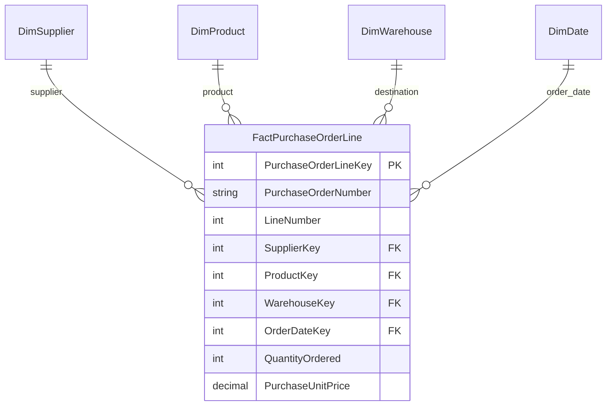
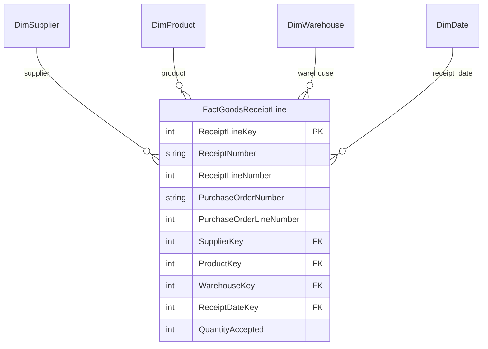
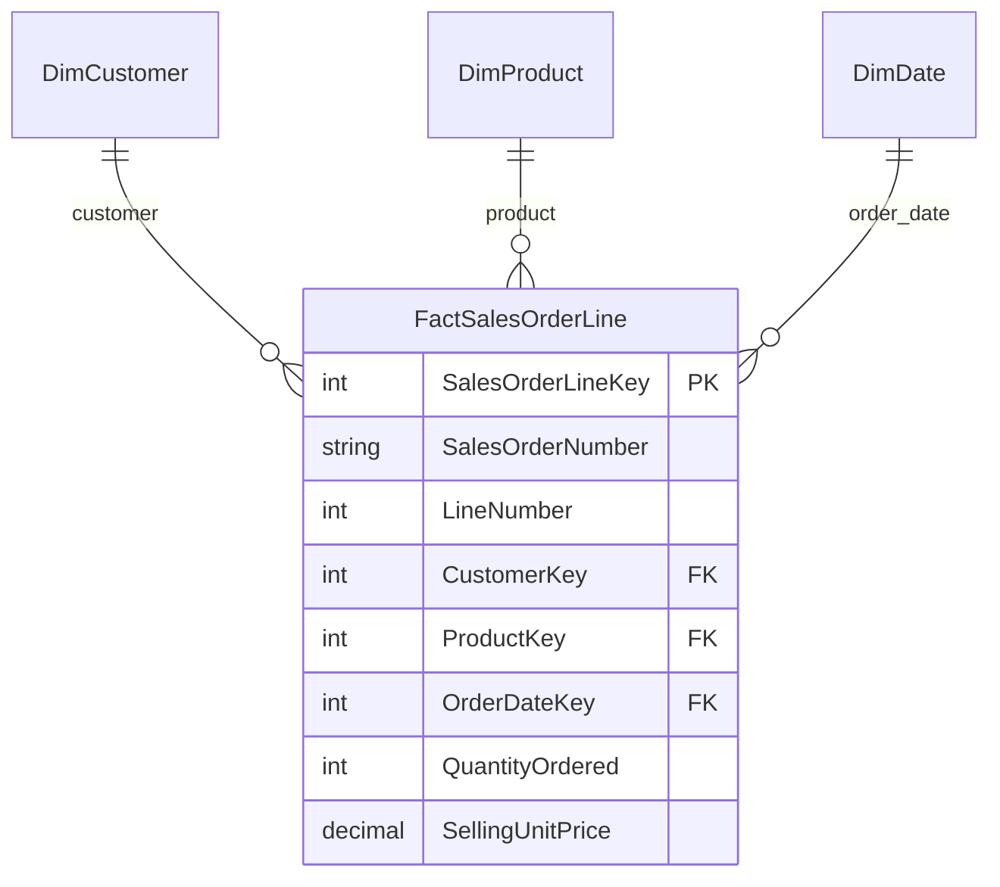
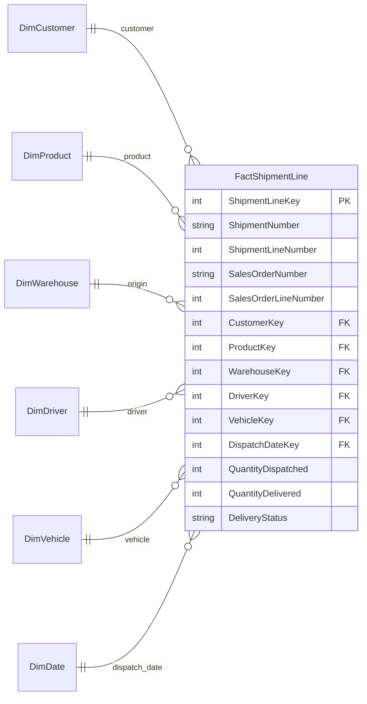
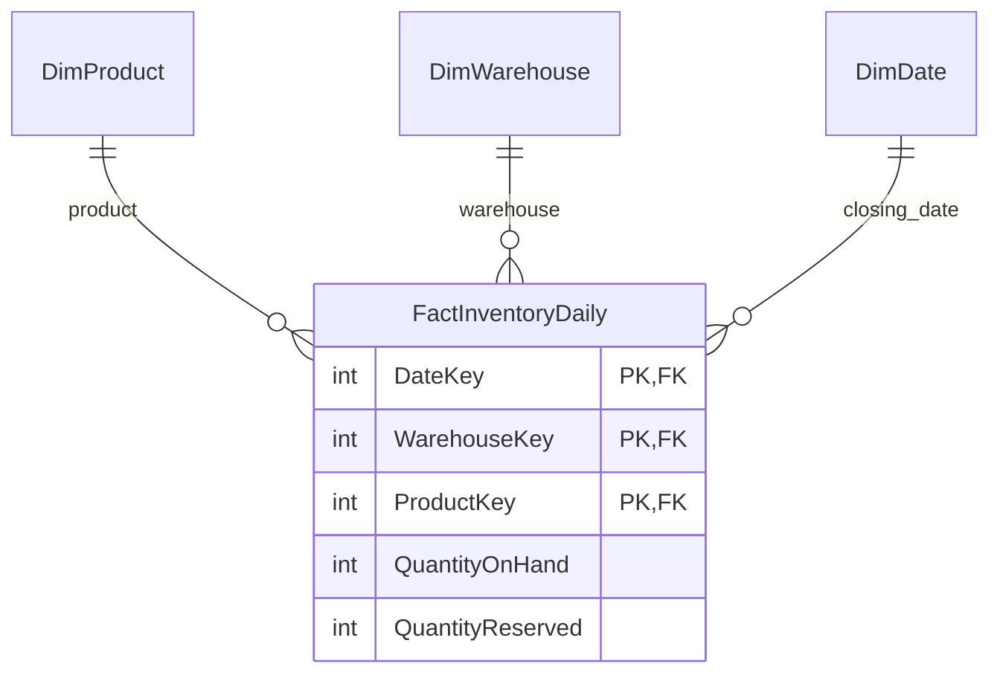

# Day 2 Project: Logistics & Supply Chain Database

I designed a database model for a fictional company that buys goods, stores them, and delivers them to shops. This project applies the fact and dimension tables introduced in class.

**Status:** Database design completed as a learning draft. SQL implementation is planned.

## The business

**FlowLink** buys packaged goods from manufacturers and sells them to supermarkets.

A typical transaction looks like this:

1. FlowLink orders goods from a supplier.
2. The supplier sends the goods to a warehouse.
3. A shop places an order with FlowLink.
4. FlowLink sends the goods using a driver and vehicle.
5. The company checks how much stock remains.

The supplier sells to FlowLink. The customer buys from FlowLink.

## One example to follow

FlowLink orders **100 cartons of cooking oil** from FreshOil Manufacturing at **BDT 1,000 per carton**.

The supplier sends 60 cartons first and 40 later.

City Mart then orders **30 cartons** at **BDT 1,200 per carton**. FlowLink sends 20 cartons with Hasan and the remaining 10 with Karim. Both deliveries succeed.

| Business activity | What happened |
| --- | --- |
| Purchase order | 100 cartons ordered |
| Goods receipts | 60 cartons received, then 40 |
| Customer order | 30 cartons requested |
| Shipments | 20 cartons sent, then 10 |
| Remaining stock | 70 cartons |

The stock calculation assumes there was no opening stock and no other stock movement.

**The important difference:** an order records a request. A receipt or shipment records what actually moved.

## The database structure

**Dimensions describe the business. Facts record its activities and quantities.**

The model uses these shared dimension tables:

| Dimension | Details stored |
| --- | --- |
| DimSupplier | SupplierKey, SupplierName, Phone |
| DimProduct | ProductKey, ProductName, Category, UnitOfMeasure |
| DimCustomer | CustomerKey, CustomerName, Phone, City |
| DimWarehouse | WarehouseKey, WarehouseName, Address |
| DimDriver | DriverKey, DriverName, Phone |
| DimVehicle | VehicleKey, RegistrationNumber, VehicleType |
| DimDate | DateKey, FullDate, MonthNumber, YearNumber |

Each table's Key is its primary key. For example, DriverKey identifies one driver.

The diagrams below show one process at a time. A repeated name such as DimProduct means the **same table**, not a new copy.

**PK** identifies a row. **FK** connects it to a dimension. Each dimension can connect to many fact rows.

## 1. Purchasing: What did we order?

**One row = one product line on a purchase order.**

Our example has one line: 100 cartons of oil at BDT 1,000 each.

**Business question:** How much did we order from each supplier?

## 2. Receiving: What arrived?

**One row = one receipt line for a purchase-order line.**

Our example needs two rows: one for 60 cartons and one for 40 cartons. Both refer to the same purchase-order line.

**Business question:** How much of our order is still waiting to arrive?

After the first receipt: 100 ordered - 60 received = **40 cartons outstanding**.

## 3. Sales: What did the customer request?

**One row = one product line on a customer order.**

City Mart's order creates one row for 30 cartons at BDT 1,200 each.

**Business question:** Which products do customers order most?

City Mart's ordered amount is 30 x 1,200 = **BDT 36,000**. This is an order amount, not proof of payment or recognized revenue.

## 4. Shipping: What did we send?

**One row = one product line within a shipment, fulfilling one sales-order line.**

Our example creates two rows: Hasan sends 20 cartons, and Karim sends 10 later.

**Business question:** Which orders are not fully delivered?

After the first successful delivery: 30 ordered - 20 delivered = **10 cartons still to deliver**.

QuantityDelivered stays unknown until the delivery result is recorded. A shipment with several products has several rows sharing the same ShipmentNumber.

## 5. Inventory: What stock remains?

**One row = one product at one warehouse at the end of one day.**

The three keys together identify a row.

- **QuantityOnHand:** Goods physically in the warehouse.
- **QuantityReserved:** Goods set aside for orders but still in the warehouse.
- **Available stock:** QuantityOnHand - QuantityReserved.

After receiving 100 cartons and dispatching 30, FlowLink has **70 cartons on hand**. Stock leaves the warehouse balance at dispatch, not when delivery is confirmed.

**Business question:** Which warehouse has stock available for a new order?

## Rules for this first design

- FlowLink owns the goods it buys.
- Each purchase-order line has one planned receiving warehouse.
- Each shipment serves one sales order and uses one warehouse, driver, and vehicle.
- All products have a defined stock unit. This example uses cartons.
- Purchase and sales orders can be fulfilled in parts.
- Receipts must match their purchase-order lines. Shipment lines must match their sales-order lines.
- Quantities cannot exceed the related ordered quantities in this version.
- Returns, damaged goods, transfers, payments, and repeated delivery attempts are future additions.

This is a reporting model. A working system also needs rules for safely processing transactions and checking stock.

## What I learned

**Define the row before choosing the columns.** One shipment is different from one product line in a shipment. This definition is called the table's grain.

**Keep requests separate from physical events.** Ordered, received, dispatched, and delivered quantities can differ.

**Avoid double counting.** Total receipts by purchase-order line before comparing them with ordered quantities. Do the same for shipments and sales-order lines.

**Count shipment numbers, not shipment rows.** One shipment can contain several products.

**Do not add stock balances across dates.** Having 70 cartons on Monday and the same 70 on Tuesday does not mean there are 140 cartons.

## Next step

Implement the tables in SQL, add the example records, and check that queries return:

- 100 cartons ordered from the supplier.
- 100 cartons received.
- 30 cartons ordered by City Mart.
- 30 cartons dispatched and delivered.
- 70 cartons remaining in the warehouse.

## Learning sources

This project applies the fact-and-dimension approach introduced in class. I used AI to help explore the business and draft the design. The company, assumptions, and example transactions are fictional and should be reviewed with my instructor.
